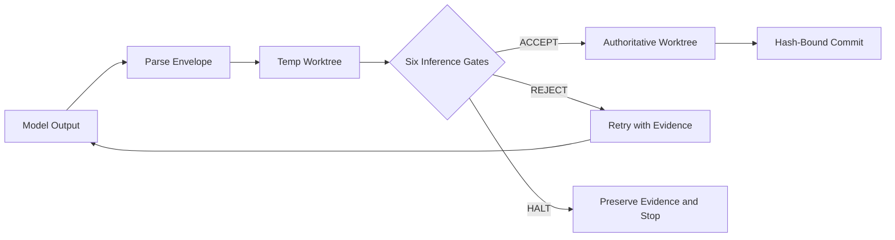
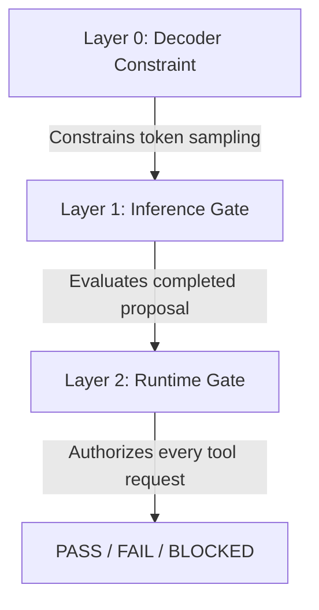

# Bounded Runtime Harness


A skills-only ChatGPT and Codex plugin that enforces governance contracts at inference time.
It gives coding agents a structured governance framework and a fail-closed runtime enforcement layer.
No model output reaches the authoritative worktree unless all gates pass.

## Architecture



## Quick Start

### Prerequisites

- Python 3
- A ChatGPT or Codex host stack (or a local serving stack such as vLLM)

### Install from the marketplace

```bash
codex plugin marketplace add https://github.com/Lvvphole/harness
```

### Package from source

Run the package script to create a rootless archive for distribution.

```bash
bash scripts/package-codex-plugin.sh --output /tmp/harness.zip
```

### Try it

Use these default prompts after you install the plugin.

**Scaffold governance files for a repository:**

```text
Scaffold evaluation-first governance files for this repository.
```

This prompt runs the governance skill.
It produces `CLAUDE.md`, `AGENTS.md`, `CONTEXT.md`, a `.harness/` directory, and a `.governance/` directory.
Verification artifacts come before implementation code.

**Compile contracts into a runtime controller:**

```text
Compile existing .harness contracts into a bounded runtime controller with forbidden-action tests.
```

This prompt runs the bounded-runtime-harness skill.
It produces a fail-closed execution controller with proposal envelopes, inference gates, and runtime gates.
The controller writes forbidden-action tests before it writes implementation code.

## Skills

| Skill | Version | Purpose |
|---|---|---|
| governance | 2.0 | Scaffold an evaluation-first governance file hierarchy for a repository. |
| bounded-runtime-harness | 1.1 | Compile governance contracts into a fail-closed execution controller. |

<details>
<summary>Governance skill details</summary>

This skill writes an evaluation-first file tree for a repository.
It uses Interpretable Context Methodology (ICM) for file routing.
It uses Evaluation-Driven Development (EDD) for generation order.

The skill produces these files:

- `CLAUDE.md` -- project entry point for the agent.
- `AGENTS.md` -- build, test, style, and workflow rules.
- `CONTEXT.md` -- task-type routing with verification contracts.
- `.harness/` -- evaluation catalog, inference loop, runtime loop, and per-task contracts.
- `.governance/` -- security policy, testing policy, style rules, review-repair invariants, and risk register.

A task is complete only when its oracles pass.

</details>

<details>
<summary>Bounded-runtime-harness skill details</summary>

This skill compiles governance contracts into a fail-closed execution controller.
The controller owns the path between decoder constraints and authorized writes.

The controller enforces these items:

- **Proposal envelope** -- the model must emit a typed envelope, not raw edits.
- **Six inference gates** -- parse/compile, scope, secrets, injection, contract preview, and retry policy.
- **Runtime gate** -- tool authorization, allow-lists, path checks, budget limits, and stop conditions.
- **Transactional worktree** -- all edits apply to an isolated filesystem copy first.
- **Hash-bound commits** -- the SHA-256 hash is bound at accept time. A mismatched hash is refused.
- **Immutable evidence** -- every decision writes a JSON record that cannot be overwritten.

</details>

## How It Works

1. The model emits a structured proposal envelope, not free-form edits.
2. The controller parses the proposal and applies it to a temporary worktree.
3. Six deterministic gates evaluate the proposal against the active contract.
4. On ACCEPT, the controller writes the exact verified bytes to the authoritative worktree.
5. On REJECT, the controller discards the temporary state and retries.
6. On HALT, the controller preserves evidence and stops.

**Decisive invariant:** the bytes written to the authoritative worktree are the bytes that passed all gates.
The controller binds the proposal hash at accept time.
A commit with a different hash is refused.

## Enforcement Layers



**Layer 0: Decoder constraint.**
This layer controls what tokens the model can emit.
It requires decoder controls on the host stack.
On ChatGPT UI, this layer is best-effort.

**Layer 1: Inference gate.**
This layer evaluates a completed proposal before any write.
Six deterministic gates run against the proposal.
A failure at any gate causes a REJECT or HALT decision.

**Layer 2: Runtime gate.**
This layer authorizes every tool request through pre-execution hooks.
It enforces allow-lists, path restrictions, budget limits, and stop conditions.

## What Ships

The packaged archive contains only these paths:

```
.codex-plugin/plugin.json
skills/governance/
skills/bounded-runtime-harness/
README.md
LICENSE
```

Source-only files (`.harness/`, `.governance/`, `scripts/`, `tests/`, `AGENTS.md`, `CLAUDE.md`, `CONTEXT.md`) are excluded.

<details>
<summary>Verification commands</summary>

Run these commands from the repository root to verify the full oracle suite.
All commands must exit with code 0 and zero failures.

```bash
# Governance file tree (51 assertions)
bash scripts/eval-governance-tree.sh .

# Bounded-runtime-harness skill integrity (20 assertions)
bash skills/bounded-runtime-harness/scripts/eval-skill.sh

# Governance skill integrity (13 assertions)
bash skills/governance/scripts/eval-skill.sh

# Forbidden-action and byte-identity tests (28 tests)
python3 skills/bounded-runtime-harness/assets/reference/tests/test_harness.py

# Marketplace manifest parse
bash tests/codex/test-marketplace-manifest.sh

# Plugin packaging (12 assertions)
bash tests/codex/test-package-codex-plugin.sh
```

</details>

## License

[MIT](./LICENSE). Copyright 2026 Emory Harris.
